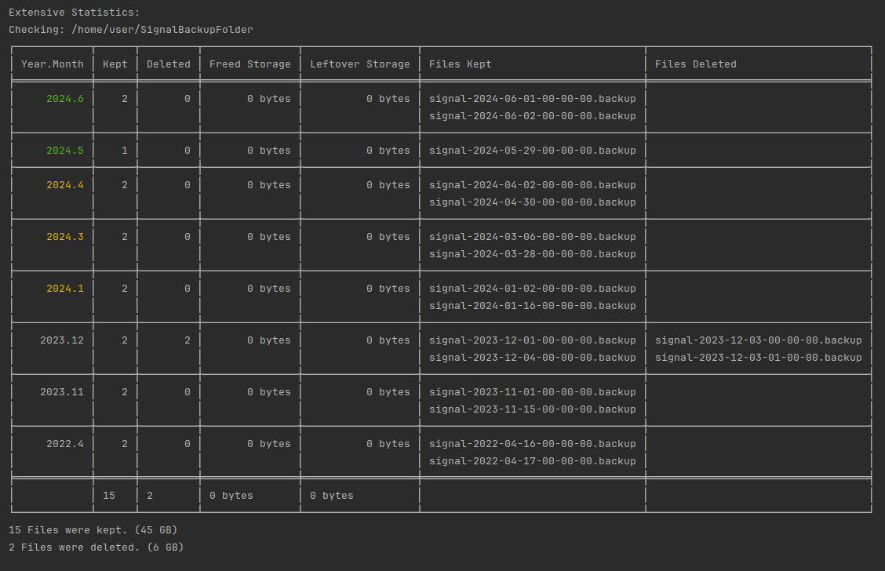

# Signal Backup Purge - Sensible cleanup for signal backups
[](https://github.com/newhinton/Signal-Backup-Purge/blob/master/LICENSE)
[](https://felixnuesse.de/donate) [](https://roundsync.com)


A cli-tool to clean your signal backup folder. This is only useful if you move your backups off your android device and keep multiple copies.

## Features

- **Dynamic Retention Control** You choose how many months are kept fully or partial
- **Statistics** Show you how much storage you save by purging old backups!
- **Easy to use** Simple rules make it easy to predict what is kept!

## Installation

Grab the latest release and run it like this:

```sh
# java needs to be configured in the PATH-variable
java -jar Signal-Backup-Purge.jar -h
```

## Disclaimer
Use this tool on your own risk. Make sure you do not delete anything on accident. This tool has no option to restore anything.
If you are unsure, never ever use the `-y`-option, and always use the `-m`-option. What they do, see below.

I am not taking responsibility for any lost data.

## Usage

```
Usage: signal-backup-purge [<options>] [<source>]

Scan <source> for Signal Backups. This tool keeps 6 full months of your backups by default, and 6 months after that keep 2 backups.

This is called the secondary retention. Secondary retention tries to evenly distribute kept backups over the month,keeping less and less backups the
further in they are in the secondary phase.After the secondary retention period, only the first and the middle-most backup per month is kept.

Note: Only files named "signal-yyyy-MM-dd-HH-mm-ss.backup" are recognized. Be careful to check that all the files are named that way! Files that do not
start with 'signal' and end with '.backup' are ignored regardless.

Options:
--version                    Show the version and exit
-d, --delete                 Immediately delete Files.
-m, --move                   Move files to 'deleted' folder instead of deleting. Takes precedent above -d
-n, --dry-run                Print all files that would be deleted by -d.
-y, --yes                    Answer all prompts with yes. USE CAREFULLY!
-p, --print-manual-deletion  Print a list of shell commands to purge the signal backup folder manually.
-s, --stats                  Print statistics about the purge.
-e, --stats-extensive        Print even more statistics about the purge.
-t, --tiny                   A reduced, less table centric statistic view
-k, --keep=<int>             Primary Retention Period: This determines how many months keep all backup files.
-c, --keep-secondary=<int>   Secondary Retention Period: This determines how many months keep two backup files, beginning with the first month after the
primary retention period.
-v, --verbose                Increases detail of the output. Shows deletions and kept files.
-h, --help                   Show this message and exit
```

### Example:

Running `java -jar Signal-Backup-Purge.jar -k 3 -c 4 -e /home/user/SignalBackupFolder` will yield:



(The above image has been slightly tampered with, because my testfiles do not contain any data. Therefore they are empty.)


Donations
------------

If you like my work, either this app or in general, you are more than welcome to leave a donation.
It helps me to dedicate time to further improve my apps!

[Paypal](https://www.paypal.com/paypalme/felixnuesse) | [Liberapay](https://liberapay.com/newhinton) | [Github Sponsor](https://github.com/sponsors/newhinton)


## Libraries
- [CLICKT](https://ajalt.github.io/clikt/) - Command Line Parser for kotlin
- [ascii-table](https://github.com/freva/ascii-table) by [freva](https://github.com/freva) - Command Line Table Formatter
- [Janis](http://fusesource.github.io/jansi/) - Command Line Colorizer

## Contributing

Anyone is welcome to contribute and help out. However, hate, discrimination and racism are decidedly unwelcome here. If you feel offended by this, you might belong to the group of people who are not welcome. I will not tolerate hate in any way.

## Developing


You can then build the app:

```sh
# build jar
./gradlew jar

```


For development you can also run the tool directly:

```sh
# build jar
./gradlew execute --args="-k 3 -c 4 -s testfiles/"

```

See the help for an explanation for the flags.


## License
This app is released under the terms of the [GPLv3 license](https://github.com/newhinton/signal-backup-purge/blob/master/LICENSE).


